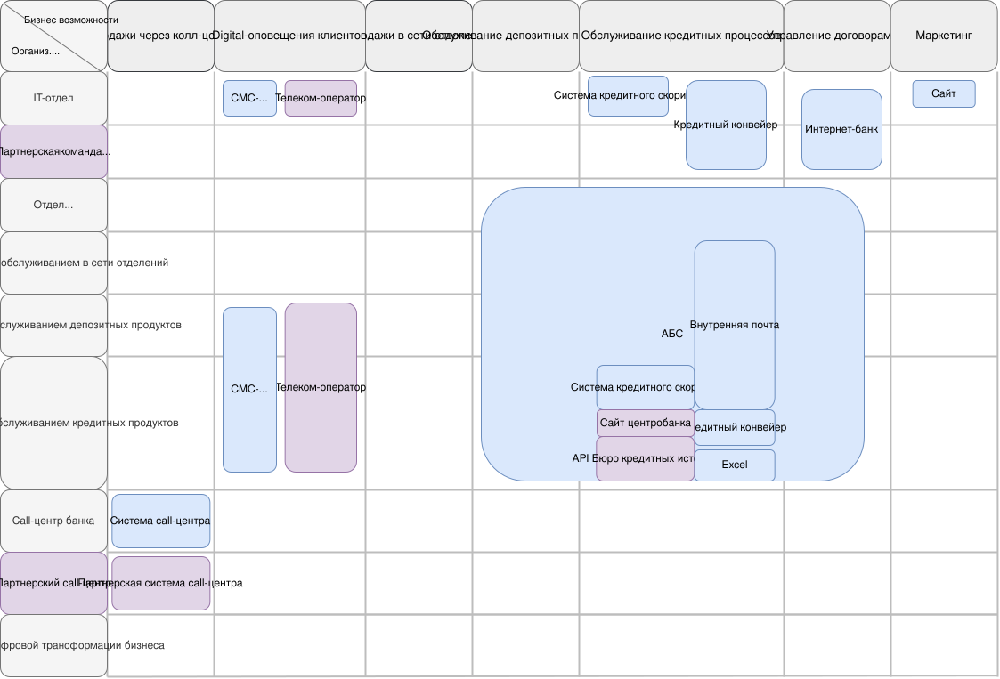
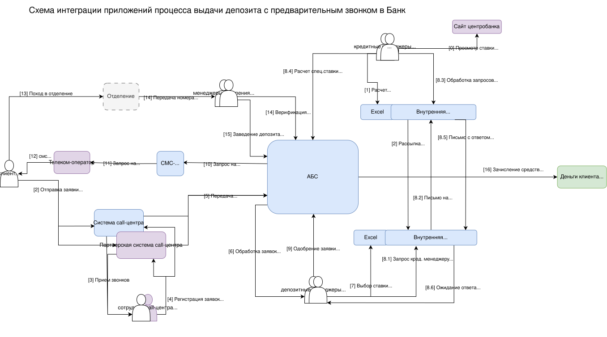
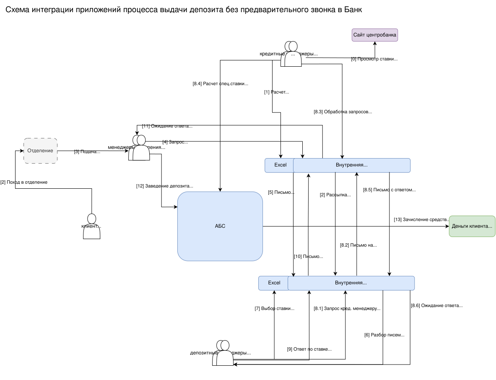
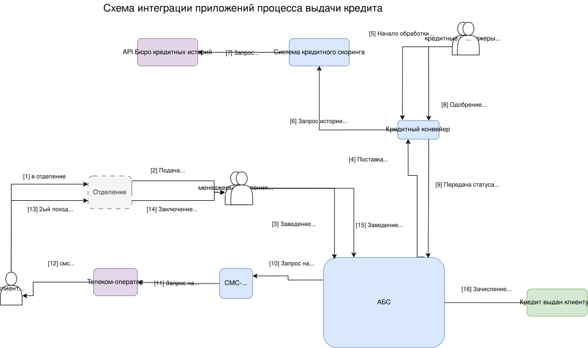

## [Оглавление](../README.md)

## Задание 1. Карта текущего IT-ландшафта и схема интеграции приложений
### Карта текущего IT ландшафта

### Схемы интеграции приложений с указанием участников процессов

### Описание кредитного процесса (основной процесс)
- клиент должен прийти в отделение [1], чтобы подать заявку на кредит через менеджера [2];
- менеджер отделения заводит заявку в АБС [3] и вероятно уведомляет клиента о сроках рассмотрения и возможном диапазоне параметров кредита;
- заявка автоматически поступает из АБС в кредитный конвейер раз в сутки [4];
- кредитный менеджер бэк-офиса инициирует разбор заявок в порядке очереди в конвейере[5];
- под капотом конвейер делает запрос в систему кредитного скоринга [6];
- а система кредитного скоринга делает запрос по истории клиента во внешнее Бюро кредитных историй [7];
- кредитный менеджер на основании всех данных по клиенту одобряет [8] заявку;
- статус заявки прорастает в АБС [9];

Ниже - допущения о том, что в первом походе в отделение клиент только подал заявку на кредит (но не заключил договор).
- АБС отправляет запрос в СМС-шлюз на отправку СМС клиенту об одобрении кредита и его параметрах [10];
- СМС-шлюз отправляет запросы на отправку СМС клиентам, в том числе и по кредитным заявкам [11], внешнему телеком-оператору;
- телеком-оператор доставляет СМС клиенту [12];
- клиент повторно идет в отделение [13];
- и заключает кредитный договор через менеджера отделения [14];
- менеджер отделения заводит кредитный договор в АБС [15];
- АБС инициализирует перечисление кредитных средств [16] клиенту;