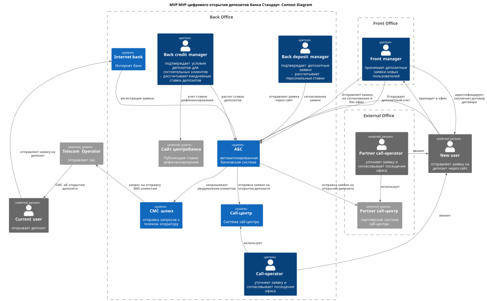
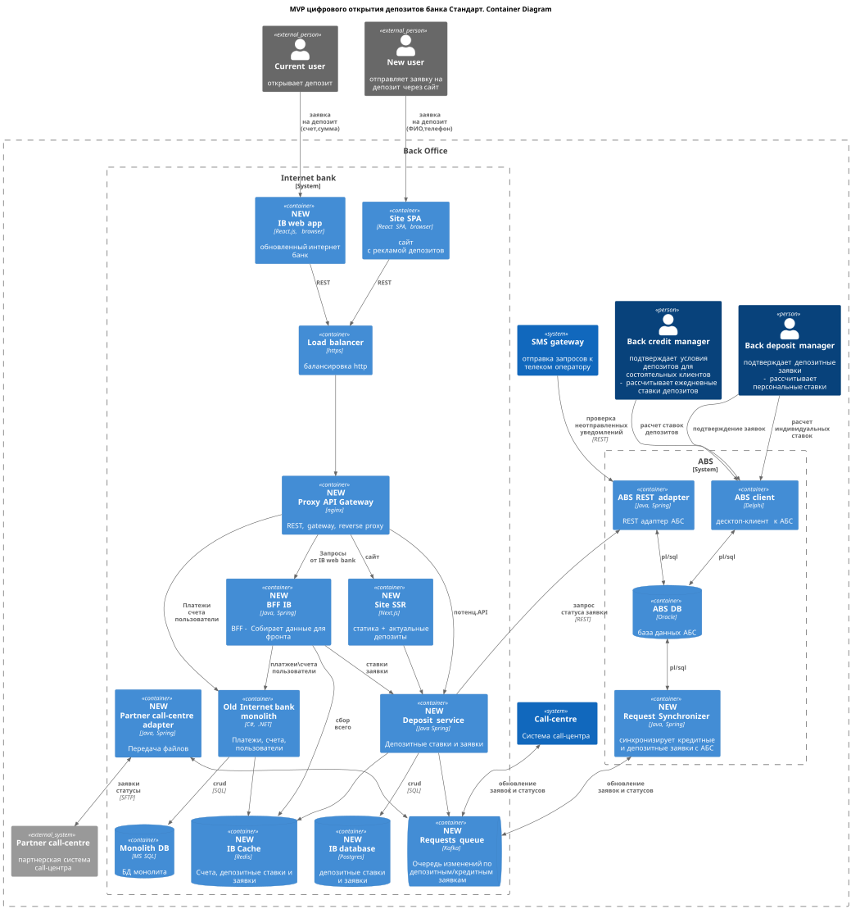

## [Оглавление](../README.md)

## Задание 3. ADR MVP цифрового открытия депозитов
- **Name: MP-ADR1 MVP цифрового открытия депозитов**
- **Author: Алексей Андреев**
- **Date: 25.06.22**

### **Функциональные требования**
> Опишите здесь верхнеуровневые Use Cases. Их нужно оформить в виде таблицы с пошаговым описанием:

| **№** | **Действующие лица или системы**                                                                                                                                                                                                                      | **Use Case**                                                      | **Описание**                                                                                                                                                                                                                                                                                                                                                                                                                                                                                                                                                                                                                                                                                                                                                                                                                                                                                                         |
|:-----:|:------------------------------------------------------------------------------------------------------------------------------------------------------------------------------------------------------------------------------------------------------|:------------------------------------------------------------------|:---------------------------------------------------------------------------------------------------------------------------------------------------------------------------------------------------------------------------------------------------------------------------------------------------------------------------------------------------------------------------------------------------------------------------------------------------------------------------------------------------------------------------------------------------------------------------------------------------------------------------------------------------------------------------------------------------------------------------------------------------------------------------------------------------------------------------------------------------------------------------------------------------------------------|
|   1   | люди:  - клиент - оператор колл-центра - менеджер отделения - депозитный менеджер бэк-офиса - кредитный менеджер бэк-офиса (для состоятельных клиентов)    системы:  сайт, АБС, системы колл-центра (банка и внешняя) | Оформление заявки на депозит через сайт новым клиентом            | 1. Новый клиент заходит на сайт, выбирает депозит из списка доступных и оставляет заявку на него (ФИО, телефон). Заявка попадает в АБС. 2. Заявка прорастает до систем колл-центра, оператор колл-центра обрабатывает заявку, проверяя можно ли предложить особые условия по ставкам и перезванивает клиенту, и согласовывает посещение удобного отделения  3.Клиент приходит в отделение, проходит идентификацию, менеджер меняет статус АБС заявки на "требуется подтверждениеЭ.  4. Депозитный менеджер бэк-офиса сверяется с текущими ставками и одобряет заявку (менее 20 мин). При необходимости он через АБС может согласовать повышенную ставку для состоятельных клиентов у кредитного менеджера, который там же в АБС дает ответ.  5. Менеджер отделения заключает договор, регистрирует договор и депозит в АБС, принимает деньги клиента и отправляет их на только что открытый депозит. |
|   2   | люди:  - клиент - депозитный менеджер бэк-офиса    системы:  интернет-банк, АБС, СМС-шлюз, телеком оператор                                                                                                                       | Оформление заявки на депозит через интернет-банк                  | 1. Действующий клиент, имеющий средства на текущем счете банка в интернет банке выбирает депозит с актуальными ставками и персональными условиями.  2.Клиент выбирает выбирает депозит и оставляет заявку (сумма, номер счета для списания денег на депозит); заявка под капотом создается в АБС.  3. Депозитный менеджер проверяет отсутствие ошибки и подтверждает заявку в АБС. 4. СМС-шлюз по запросу от АБС через телеком-оператора отправляет клиенту подтверждение открытия депозита.                                                                                                                                                                                                                                                                                                                                                                                                                 |
|   3   | люди:  - кредитный менеджер бэк-офиса    системы:  АБС, внешний сайт центробанка РФ                                                                                                                                                   | Ежедневные обновления ставок депозитов                            | 1. Кредитный менеджер бэк-офиса на основании баланса банка, ставки рефинансирования и др.параметров рассчитывает в АБС актуальные ставки для депозитов, ставки становятся доступны фронт и бэк-офису.                                                                                                                                                                                                                                                                                                                                                                                                                                                                                                                                                                                                                                                                                                                |
|   4   | люди:  - депозитный менеджер бэк-офиса    системы:  АБС, интернет-банк                                                                                                                                                                | Расчеты персональных ставок депозитов обновления ставок депозитов | 1. Депозитный менеджер бэк-офиса рассчитывает в АБС персональные ставки для депозитов.   2. Ставки из ABC должны прорости до интернет-банка.                                                                                                                                                                                                                                                                                                                                                                                                                                                                                                                                                                                                                                                                                                                                                                     |

### Нефункциональные требования
>Опишите здесь нефункциональные требования и архитектурно значимые требования.

| **№** | **Требование**                                                                                                                                                                                    |
|:-----:|:--------------------------------------------------------------------------------------------------------------------------------------------------------------------------------------------------|
|       | **Надёжность (Reliability)**                                                                                                                                                                      |
|  R1   | Работа всех сервисов 24/7 (интернет-банка и др.)                                                                                                                                                  |
|  R2   | 96,67% доступность всех сервисов (интернет-банка и др.)                                                                                                                                           |
|       | **Производительность (Performance)**                                                                                                                                                              |
|  P1   | Нижкий RPS API интернет-банка на этапе запуска MVP (условно 100 RPS)                                                                                                                              |
|  P2   | Отклик по операциям в интернет-банке - до 100 мс                                                                                                                                                  |
|       | **+ Ограничения (Restrictions)**                                                          |
|  +R1  | Холодное резервирование по ДЦ в рамках MVP                                                                                                                                                        |
|  +R3  | Требуется шифрование трафика при передачи пользовательских данных с сайта/интернет банка во время оформления заявок на депозиты и кредиты                                                         |
|  +R4  | По возможности использовать существующие технологии, как минимум хранилища MS SQL, Oracle                                                                                                                                                                 |
|  +R5  | Для нового функционала бэкенда интернет-банка/сайта используем микросервисную архитектуру с развертыванием в Kubernetes с масшатабированием и load balancing                                                                                                                                                                  |
|  +R6  | Использовать Kafka для синхронизации данных по кредитным и депозитным заявкам для наиболее загруженных сервисам (например, кредитный конвейер)                                                                                                                                                                    |
|  +R8  | Требуется учесть заложить вертикальное масштабировагние для АБС и Oracle                                                                                                                                                                  |
|  +R9  | Трубется поддержать Kafka в интернет-банке: рассмотреть обновление фреймворка интернет-банка, либо замену технологий, либо требуется заложить доработку архитектуры приложения и внедрение библиотек                                                                                                                                                                    |

### Решение
> Приведите диаграммы контекста и контейнеров в модели C4. Опишите там основные компоненты и интеграции всех элементов решения.

> Также опишите, какой логикой вы руководствовались в ходе принятия решений и выбора технологий. Не забывайте, что необходимо учесть все функциональные и нефункциональные требования.

> (Из учебника) На диаграмме контейнеров нужно детализировать интернет-банк и АБС. Остальные системы — только по желанию. Обратите внимание: диаграмма должна покрывать Use Cases, которые вы также заполняете в шаблоне ADR

**Наблюдение**: Судя по уточнению из Учебника, в задании на диаграмме контекстов C4 в качестве контекста ожидается увидеть не всю систему банка целиком, а ее составляющие: АБС, интернет-банк и т.д. 

Будем исходить из этого.

**Основные решения**
- интернет-банк необходимо переписать с нуля на микросервисной архитектуре, потому что его поддержка завязана на стороннего подрядчика; выбран современный популярный стек (в том числе исходя из того, что с ним знакома команда IT отдела);
- старый монолит интернет банка должен сохранить в MVP логику платежей (как самую сложную), другие ответственности (авторизация, пользователи) необходимо вынести в отдельные микросервисы;
- для публикации событий об изменении состояния заявок (создание, изменение статуса, закрытие) из разных источников (интернет банк, сайт, АБС) нужно завести Kafka-очередь в составе системы `internet_bank`;
- для синхронного REST взаимодействия новых микро-сервисов (в интернет банке и не только) с АБС нужно завести сервис-прослойку с Oracle `ABS REST adapter`;

### Альтернативы
>Опишите здесь наиболее важные альтернативные решения
- вместо обновления фронт части для нового микро-сервисного интернет-банка сделать IOS и Android приложения; не выбрал, потому что выглядит сложнее;
- сохранить использование XLS файлов для обмена ставками по депозитам для сокращения затрат на разработку;
- gRPC вместо REST; REST выбран, потому что привычней команде IT отдела;

### Недостатки, ограничения, риски
>Подробно опишите здесь недостатки, ограничения и риски выбранного решения.
- скрытые риски (сроки, технические ограничения, стоимость доработки) во всех работах, где задействованы подрядчики или стороннее ПО, например:
  - интернет-банк;
  - система колл-центра на основе партнерского CRM;
  - внешняя система партнерского колл-центра;
- лицензионные риски на вертикальное масштабирование иностранного ПО, например, Oracle;
- если будет быстрый рост клиентской базы, то MVP решение с холодным резервированием ЦОД может привести к снижению пользовательского опыта на фоне конкурентов;
- запуск онлайн-функций без мобильных приложений может быть рискован;
- доработка отказа от XLS-файлов может потребовать значительные ресурсы на реализацию, при срыве сроков можно вынести из MVP;
- использование зоопарка технологий - проще для MVP, но в будущем точно захочется сократить номенклатуру, и потребуется больше ресурсов на рефакторинг:
  - хранилища Oracle, Postgres, MS SQL;
  - языки программирования для бэкенда С#, Python, Java;

