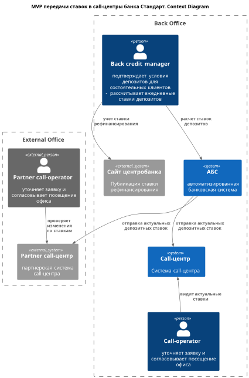
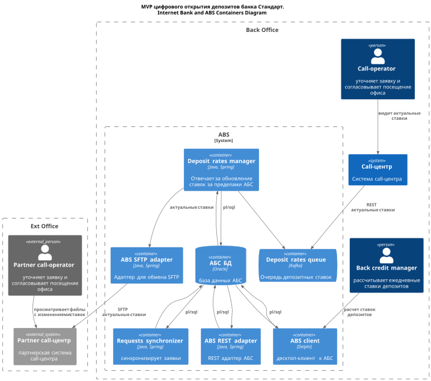
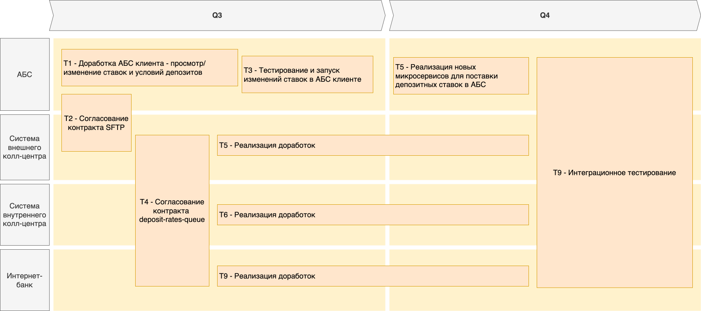

## [Оглавление](../README.md)

## Задание 4. ADR MVP передачи ставок в call-центры
- **Name: MP-ADR2 MVP передачи ставок в call-центры**
- **Author: Алексей Андреев**
- **Date: 25.06.22**

### **Функциональные требования**
> Опишите здесь верхнеуровневые Use Cases. Их нужно оформить в виде таблицы с пошаговым описанием:

| **№** | **Действующие лица или системы**                                                                                                         | **Use Case**                                                      | **Описание**                                                                                                                                                                                                                                                                                                                                                                                                                                                                                         |
|:-----:|:-----------------------------------------------------------------------------------------------------------------------------------------|:------------------------------------------------------------------|:-----------------------------------------------------------------------------------------------------------------------------------------------------------------------------------------------------------------------------------------------------------------------------------------------------------------------------------------------------------------------------------------------------------------------------------------------------------------------------------------------------|
|   1   | люди:  - кредитный менеджер - операторы колл-центров    системы:  АБС, системы колл-центра (банка и внешняя)         | Поставка ставок в системы колл-центров                            | 1. Кредитный менеджер раз в день обновляет ставки депозитов в АБС. 2. Новый компонент в АБС записывает эти обновления в очередь Kafka. 3. Система внутреннего колл-центра получает обновления из очереди, а система внешнего колл-центра через адаптер, который отправляет файлы SFTP. 4. Оператор внутреннего колл-центра сразу видит новые ставки, оператор внешнего колл-центра периодически сверяться с новыми обновлениями.                                                                     |

### Нефункциональные требования
>Опишите здесь нефункциональные требования и архитектурно значимые требования.

| **№** | **Требование**                                                                                                                                                                                       |
|:-----:|:-----------------------------------------------------------------------------------------------------------------------------------------------------------------------------------------------------|
|       | **Надёжность (Reliability)**                                                                                                                                                                         |
|  R1   | Работа всех сервисов 24/7 (интернет-банка и др.)                                                                                                                                                     |
|  R2   | 96,67% доступность всех сервисов (интернет-банка и др.)                                                                                                                                              |
|       | **Производительность (Performance)**                                                                                                                                                                 |
|       | ----                                                                                                                                                                                                 |
|       | **+ Ограничения (Restrictions)**                                                                                                                                                                     |
|  +R1  | Холодное резервирование по ДЦ в рамках MVP                                                                                                                                                           |
|  +R6  | Использовать Kafka для обмена данными (например, кредитным и депозитным заявкам, ставкам) для наиболее загруженных сервисам (интернет-банк, АБС, кредитный конвейер и др.) |                                                                                                                                       |
|  +R9  | Связь с внешним колл-центром возможна только путем обмена файлами, например SFTP                                                                                                                                            |                   |

### Решение
> Приведите диаграммы контекста и контейнеров в модели C4. Опишите там основные компоненты и интеграции всех элементов решения.

> Также опишите, какой логикой вы руководствовались в ходе принятия решений и выбора технологий. Не забывайте, что необходимо учесть все функциональные и нефункциональные требования.

> (Из учебника) На диаграмме контейнеров нужно детализировать интернет-банк и АБС. Остальные системы — только по желанию. Обратите внимание: диаграмма должна покрывать Use Cases, которые вы также заполняете в шаблоне ADR

**Наблюдение**: Судя по уточнению из Учебника, в задании на диаграмме контекстов C4 в качестве контекста ожидается увидеть не всю систему банка целиком, а ее составляющие: АБС, интернет-банк и т.д.

Будем исходить из этого.

**Основные решения**
- минимальные доработки при сохранении ставок через клиента АБС; 
- кредитный менеджер обновляет ставки в Oracle АБС через клиента;
- новый микросервис в периметре АБС Deposit Rates Manager следит за ставками в Oracle и при наличии изменений отправлет их:
  - в очередь депозитных ставок в Kafka;
  - в SFTP адаптер;
- на очередь депозитных ставок подписаны системы внутреннего коллцентра и интернет-банка (за пределами данной задачи);
- SFTP адаптер отправляет файлы в систему внешнего колл-центра;

### Альтернативы
>Опишите здесь наиболее важные альтернативные решения
- отправка по SMTP вместо SFTP, но, кажется, это менее гибким решением;
- запись ставок не только в АБС, но например, в кэш:
  - плюсы: снижаем нагрузку на чтение из Oracle (что кажется, важно исходя из описания);
  - минусы: нужна прослойка при записи данных из клиента АБС в Oracle;

### Недостатки, ограничения, риски
>Подробно опишите здесь недостатки, ограничения и риски выбранного решения.
- задержки из-за асинхронной схемы поставки ставок могут быть критичны в отдельных случаях;
- дополнительная нагрузка на чтение при проверке изменений по ставкам в `Deposit rates manager`;

### Roadmap MVP передачи ставок в call-центры
Я исходил, что нужно сделать roadmap только для кейса передачи ставок в колл-центры (без депозитны)

| **№** | **Требование**                                                                           |                            **система**                             |
|:-----:|:-----------------------------------------------------------------------------------------|:------------------------------------------------------------------:|
|  T1   | Доработка АБС клиента для возможности просматривать/менять ставки и условия по депозитам |                                АБС                                 |
|  T2   | Согласование контракта SFTP c внешней системой колл-центра                               |                 АБС, система внешнего колл-центра                  |
|  T3   | Тестирование и запуск изменения ставок в АБС клиенте                                     |                                АБС                                 |
|  T4   | Согласование контракта `deposit-rates-queue`                                             |        АБС, система внутреннего колл-центра, интернет банк         |
|  T5   | Реализация новых микросервисов для поставки депозитных ставок в АБС                      |                                АБС                                 |
|  T6   | Реализация доработок в системе внутреннего колл-центра                                   |                                АБС                                 |
|  T7   | Реализация доработок в системе внешнего колл-центра                                      |                                АБС                                 |
|  T8   | Интеграционное тестирование                                                              | АБС, система внешнего колл-центра, система внутреннего колл-центра |
|  T9   | Реализация доработок в системе интернет-банка                                |                                АБС                                 |

#### Схема

