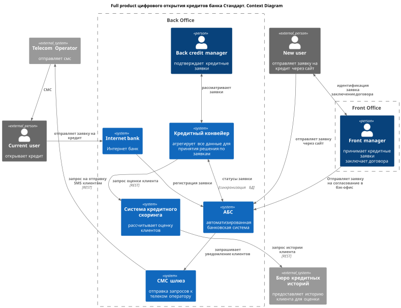

## [Оглавление](../README.md)

## Задание 5. ADR цифрового открытия кредитов
Из контекста открытие кредитов будет выполняться в течение 1 года после запуска MVP по депозитам:
- 1.5 года Full Product по кредитам:
    - заявка на открытие кредита интернет-банк и через сайт (для новых клиентов);
    - предодобренные предложения по кредитам в интернет-банке;
    - ускорение рассмотрения заявок за счет автоматизированного скоринга и ускорения взаимодействия между АБС и кредитным конвейером;

- **Name: MP-ADR1 цифрового открытия кредитов**
- **Author: Алексей Андреев**
- **Date: 25.06.22**

### **Функциональные требования**
> Опишите здесь верхнеуровневые Use Cases. Их нужно оформить в виде таблицы с пошаговым описанием:

| **№** | **Действующие лица или системы**                                                                                                                                                                         | **Use Case**                                                                     | **Описание**                                                                                                                                                                                                                                                                                                                                                                                                                                                                                                                                                                                                                                                                                                                                                                                                                                                                                               | Требования                     |
|:-----:|:---------------------------------------------------------------------------------------------------------------------------------------------------------------------------------------------------------|:---------------------------------------------------------------------------------|:-----------------------------------------------------------------------------------------------------------------------------------------------------------------------------------------------------------------------------------------------------------------------------------------------------------------------------------------------------------------------------------------------------------------------------------------------------------------------------------------------------------------------------------------------------------------------------------------------------------------------------------------------------------------------------------------------------------------------------------------------------------------------------------------------------------------------------------------------------------------------------------------------------------|:-------------------------------|
|   1   | люди:  - клиент - менеджер отделения - кредитный менеджер бэк-офиса    системы:  сайт, АБС, СМС-шлюз, телеком оператор, кредитный конвейер, система кредитного скоринга          | Оформление заявки на кредит (минимальные требования) через сайт новым клиентом - | 1. Новый клиент заходит на сайт, выбирает кредит из списка и оставляет заявку на него, оставляю только сумму, ФИО и телефон. 2. Заявка попадает в АБС.   3. Т.к. паспортных данных в заявке нет, но скоринг не возможен и клиенту сразу приходит смс, что необходимо прийти в офис для идентификации.  4.Клиент приходит в отделение, проходит идентификацию, менеджер меняет статус АБС заявки на "требуется подтверждение".  5. Заявка попадает в кредитный конвейер, откуда клиент получает оценку через систему скоринга и обрабатывается кредитным менеджером бэк-офиса (цель - в течение текущего дня).   6. Ответ из кредитного конвейера попадает в АБС, клиенту приходит СМС об изменении статуса заявки.  7. Клиет повторно приходит в отделение и заключает договор.  8. Менеджер отделения регистрирует договор в АБС, кредитные деньги поступают на счет клиента. | F14 - F16, F22 - F24, F26, F27 |
|   2   | люди:  - клиент - менеджер отделения - кредитный менеджер бэк-офиса    системы:  сайт, АБС, СМС-шлюз, телеком оператор, кредитный конвейер, система кредитного скоринга          | Оформление заявки на кредит (максимальные требования) через сайт новым клиентом  | 1. Новый клиент заходит на сайт, выбирает кредит из списка и оставляет заявку на него, оставляю только паспортные данные. 2. Заявка попадает в АБС.   3. Т.к. паспортные данных в заявке есть, заявка попадает в кредитный конвейер для автоматической оценки через систему кредитного.  4. После получения оценки кредитный менеджер бэк-офиса ставит финальный вердикт.   5. Заявка попадает в АБС, которая инициализирует отправку смс, что заявка одобрена и необходимо прийти в офис для заключения договора.   6.Клиент приходит в отделение, менеджер регистрирует договор в АБС.  7. Менеджер отделения регистрирует договор в АБС, кредитные деньги поступают на счет клиента.                                                                                                                                                                                            | F14, F15, F17, F22 - F25, F27  |
|   3   | люди:  - клиент - менеджер отделения - кредитный менеджер бэк-офиса    системы:  интернет-банк, АБС, СМС-шлюз, телеком оператор, кредитный конвейер, система кредитного скоринга | Оформление заявки на кредит в интернет-банке                                     | 1. Система кредитного скоринга периодически пересчитывает кредитные условия для клиента.   2. Предодобренные предложения по кредиту видны в интернет банке, клиент выбирает нужное и оставляет заявку и подтверждает ее кодом из СМС.   3. Заявка сразу попадает в АБС, затем в кредитный конвейер.   4. Кредитный менеджер финально одобряет заявку, статус проходит до АБС.    5. АБС инициализирует отправку СМС, что заявка одобрена и необходимо прийти в офис для заключения договора.   5.Клиент приходит в отделение, менеджер регистрирует договор в АБС.  6. Менеджер отделения регистрирует договор в АБС, кредитные деньги поступают на счет клиента.                                                                                                                                                                                                                  | F18 - F21, F24 - F27           |

### Нефункциональные требования
>Опишите здесь нефункциональные требования и архитектурно значимые требования.

| **№** | **Требование**                                                                                                                                                             |
|:-----:|:---------------------------------------------------------------------------------------------------------------------------------------------------------------------------|
|       | **Надёжность (Reliability)**                                                                                                                                               |
|  R1   | Работа всех сервисов 24/7 (интернет-банка и др.)                                                                                                                           |
|  R2   | 96,67% доступность всех сервисов (интернет-банка и др.)                                                                                                                    |
|       | **Производительность (Performance)**                                                                                                                                       |
|  P1   | Низкий RPS API интернет-банка на этапе запуска MVP (условно 100 RPS)                                                                                                       |
|  P2   | Отклик по операциям в интернет-банке - до 100 мс                                                                                                                           |
|  P3   | Поставка кредитных заявок в кредитный конвейер - менее 10 мин (но без синхронизации баз АБС и кредитного конвейера)                                                        |
|  P4   | Рост нагрузки x2 на кредитный конвейер, систему кредитного скоринга                                                                                                        |
|       | **+ Ограничения (Restrictions)**                                                                                                                                           |
|  +R1  | Холодное резервирование по ДЦ в рамках MVP                                                                                                                                 |
|  +R3  | Требуется шифрование трафика при передачи пользовательских данных с сайта/интернет банка во время оформления заявок на депозиты и кредиты                                  |
|  +R4  | По возможности использовать существующие технологии, как минимум хранилища MS SQL, Oracle                                                                                  |
|  +R5  | Для нового функционала бэкенда интернет-банка/сайта используем микросервисную архитектуру с развертыванием в Kubernetes с масшатабированием и load balancing               |
|  +R6  | Использовать Kafka для обмена данными (например, кредитным и депозитным заявкам, ставкам) для наиболее загруженных сервисам (интернет-банк, АБС, кредитный конвейер и др.) |                                                                                                                                       
|  +R8  | Требуется учесть заложить вертикальное масштабирование для АБС и Oracle                                                                                                    |
| +R10  | Новые технологии должны быть понятные разработчикам                                                                                                                        |                  
| +R11  | Все новые вызовы в АБС должны проходить через интеграционный, ограничивающий нагрузку на АБС                                                                               |                  
| +R12  | Обработка заявок не должна влиять на основную БД АБС — используется буферизация, промежуточное хранилище или очередь                                                       |                                                                                                                                       

### Решение
> Приведите диаграммы контекста и контейнеров в модели C4. Опишите там основные компоненты и интеграции всех элементов решения.

> Также опишите, какой логикой вы руководствовались в ходе принятия решений и выбора технологий. Не забывайте, что необходимо учесть все функциональные и нефункциональные требования.

> (Из учебника) На диаграмме контейнеров нужно детализировать интернет-банк и АБС. Остальные системы — только по желанию. Обратите внимание: диаграмма должна покрывать Use Cases, которые вы также заполняете в шаблоне ADR

**Примечания**: 
- Судя по уточнению из Учебника, в задании на диаграмме контекстов C4 в качестве контекста ожидается увидеть не всю систему банка целиком, а ее составляющие: АБС, интернет-банк и т.д. Будем исходить из этого.
- Все новые контейнеры помечены как NEW;
- За новые микросервисы в периметрах АБС будет отвечать отдел разработки АБС
- За новые микросервисы в системах интернет банка, кредитного конвейера и кредитного скоринга будет отвечать отдел IT;

- 

**Основные решения**
- для публикации событий об изменении состояния заявок (создание, изменение статуса, закрытие) из разных источников (интернет банк, сайт, АБС, кредитный конвейер) предполагается использовать отдельный топик Kafka-очереди в составе системы `internet_bank`, добавленной в рамках MVP;
- за регулярные обновления условий по кредитам будет отвечать `Pre Requests Manager` в составе Кредитного конвейера, который будет:
  - периодически вызывать кредитный конвейер, чтобы пересчитывать предодобренные заявки;
  - под капотом будет также вызывать система кредитного скоринга;
- обновленный SSR сайт интернет банка, js вместо PHP;
- новый функционал вокруг кредитных заявок в ИБ и кредитном конвейере написать на микросервисной архитектуре; выбран стек Java, Spring - в том числе исходя из того, что с ним знакома команда IT отдела;
- старый монолит интернет банка должен сохранить в MVP всю логику, в т.ч платежи (как самую сложную);
- предполагается, что другие ответственности (авторизация, пользователи, платежи и т.п.) будут выноситься из монолита в микросервисы командой ИТ отдела за рамками MVP;
- для интеграции монолита и новых микросервисов завести новый прокси-сервис;
- заложен BFF для веб-приложения интернет банка;
- предполагается, что для мобильных приложений затем также появятся свои BFF;
- для синхронного REST взаимодействия новых микро-сервисов (в интернет банке и не только) с АБС нужно доработать сервис-прослойку с Oracle `ABS REST adapter`, которая по идее должна быть, и, возможно, перевести ее на стек других микросервисов;

### Альтернативы
>Опишите здесь наиболее важные альтернативные решения
- оставить синхронное обновление статусов заявок; чревато проблемами с АБС, как с мастер системой;
- вместо обновления фронт части для нового микро-сервисного интернет-банка сделать IOS и Android приложения; не выбрал, потому что выглядит сложнее;
- gRPC вместо REST; REST выбран, потому что привычней команде IT отдела;

### Недостатки, ограничения, риски
>Подробно опишите здесь недостатки, ограничения и риски выбранного решения.
- скрытые риски (сроки, технические ограничения, стоимость доработки) во всех работах, где задействованы подрядчики или стороннее ПО, например:
    - интернет-банк;
- лицензионные риски на вертикальное масштабирование иностранного ПО, например, Oracle;
- если будет быстрый рост клиентской базы, то MVP решение с холодным резервированием ЦОД может привести к снижению пользовательского опыта на фоне конкурентов;
- запуск онлайн-функций без мобильных приложений может быть рискован;
- использование зоопарка технологий - проще для MVP, но в будущем точно захочется сократить номенклатуру, и потребуется больше ресурсов на рефакторинг:
    - хранилища Oracle, Postgres, MS SQL;
    - языки программирования для бэкенда С#, Python, Java;

